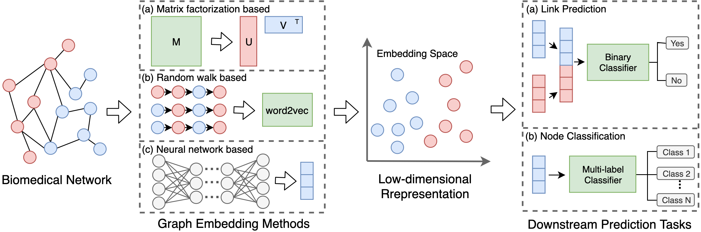

# BioNEV (Biomedical Network Embedding Evaluation)

## 1. Introduction
This repository contains source code and datasets for paper ["Graph Embedding on Biomedical Networks: Methods, Applications, and Evaluations"](https://arxiv.org/pdf/1906.05017.pdf) (accepted by **Bioinformatics**). This work aims to systematically evaluate recent advanced graph embedding techniques on biomedical tasks. We compile 5 benchmark datasets for 4 biomedical prediction tasks (see paper for details) and use them to evaluate 11 representative graph embedding methods selected from different categories:
- 5 matrix factorization-based: Laplacian Eigenmap, SVD, Graph Factorization, HOPE, GraRep
- 3 random walk-based: DeepWalk, node2vec, struc2vec
- 3 neural network-based: LINE, SDNE, GAE

The code can also be applied to graphs in other domains (e.g., social networks, citation networks). More experimental details can be found in [**Supplementary Materials**](Supplementary%20Materials.pdf).

Please kindly cite the paper if you use the code, datasets or any results in this repo or in the paper:
```
@article{yue2020graph,
  title={Graph embedding on biomedical networks: methods, applications and evaluations},
  author={Yue, Xiang and Wang, Zhen and Huang, Jingong and Parthasarathy, Srinivasan and Moosavinasab, Soheil and Huang, Yungui and Lin, Simon M and Zhang, Wen and Zhang, Ping and Sun, Huan},
  journal={Bioinformatics},
  volume={36},
  number={4},
  pages={1241--1251},
  year={2020},
  publisher={Oxford University Press}
}
```

## 2. Pipeline


Fig. 1: Pipeline for applying graph embedding methods to biomedical tasks. Low-dimensional node
            representations are
            first learned from biomedical networks by graph embedding methods and then used as features to build
            specific classifiers for different tasks. For (a) matrix factorization-based methods, they use a data
            matrix (e.g., adjacency matrix) as the input to learn embeddings through matrix factorization. For (b)
            random walk-based methods, they first generate sequences of nodes through random walks and then feed the
            sequences into the word2vec model to learn node representations. For (c)
            neural network-based methods, their architectures and inputs vary from different models.

## 3. Dataset
Datasets used in the paper:
### Link Prediction
- [CTD DDA](data/CTD_DDA) : a drug-disease association graph extracted from [Comparative Toxicogenomics Database](http://ctdbase.org/downloads/) 
- [NDFRT DDA](data/NDFRT_DDA) : a drug-disease association graph extracted from [UMLS National Drug File](https://www.nlm.nih.gov/research/umls/sourcereleasedocs/current/NDFRT/)
- [DrugBank DDi](data/DrugBank_DDI) : a drug-drug interaction graph extracted from [DrugBank database](https://www.drugbank.ca/)
- [STRING PPI](data/STRING_PPI) : a protein-protein interaction graph extracted from [STRING database](https://string-db.org/)
### Node Classification
- [Clin Term COOC](data/Clin_Term_COOC) : a medical term-term co-occurrence graph from (Finlayson et al., 2014) [[source data]](https://datadryad.org//resource/doi:10.5061/dryad.jp917), [[paper]](https://doi.org/10.1038/sdata.2014.32) 
- [node2vec PPI](data/node2vec_PPI): a PPI graph with functional annotations used in [node2vec](https://snap.stanford.edu/node2vec/) (Grover and Leskovec, 2016)
- [Mashup PPI](data/Mashup_PPI): a experimental PPI graph with functional annotations used in [Mashup](http://cb.csail.mit.edu/cb/mashup/) (Cho et al., 2016)

Statistics:

|      Task Type      |     Dataset    | #nodes |   #edges  | Density | #labels |
|:-------------------:|:--------------:|:------:|:---------:|:-------:|:-------:|
|                     |     CTD DDA    | 12,765 |   92,813  |  0.11%  |    -    |
|                     |    NDFRT DDA   | 13,545 |   56,515  |  0.06%  |    -    |
|   Link Prediction   |  DrugBank DDI  |  2,191 |  242,027  |  10.08% |    -    |
|                     |   STRING PPI   | 15,131 |  359,776  |  0.31%  |    -    |
|                     | Clin Term COOC | 48,651 | 1,659,249 |  0.14%  |    31   |
| Node Classification |   node2vec PPI | 3,890  |   76,584  |  1.01%  |    50   |
|                     |   Mashup PPI   | 16,143 |  300,181  |  0.23%  |    28   |

## 4. *Pre-trained Embeddings*
We also release the best-performing pre-trained representations of nodes (e.g., drugs, diseases, proteins, UMLS concepts) on each dataset.
These pre-trained vectors can be used as:

- External representations to complement the biological features.
In the paper, we showed that by adding the network embedding feature into an existing computational
model
for predicting drug-disease associations, the performance is further improved (Section 4.3 in the
paper).

- Initialized values of the embedding vectors before training. We can initialize the embedding vector
for each node on a graph
with its pre-trained embedding (e.g., by looking for the corresponding entity in pre-trained vocab
look-up table rather than by random
initialization, and then continue training various graph embedding methods as before (which is often
referred
to as “fine-tuning”). We conducted experiment with this "transfer learning" idea on
the "CTD DDA" graph and showed the improvement (Section 5 in the paper).

All the pretrained vectors can be downloaded [here](http://web.cse.ohio-state.edu/~yue.149/BioNEV/pretrained/). 
The files are formatted as:

    node_num, embedding_dimension
    index_1, embedding vector 1
    index_2, embedding vector 2
    ...
 
The corresponding index to node name (or their original ID) can be found in the each dataset directory.

## 5. Code
The graph embedding learning for Laplician Eigenmap, Graph Factorization, HOPE, GraRep, DeepWalk, node2vec, LINE, SDNE uses the code from [OpenNE](https://github.com/thunlp/OpenNE)
The code of [struc2vec](https://github.com/leoribeiro/struc2vec) and [GAE](https://github.com/tkipf/gae) is from their authors. 
To ensure different source code could run successfully in our framework, we modify part of their source code.
 
#### Installation

Use the following command to install directly from GitHub;

```bash
$ pip install git+https://github.com/xiangyue9607/BioNEV.git
```

Alternatively, use the following commands to install the latest code in development mode (using `-e`):

```bash
$ git clone https://github.com/xiangyue9607/BioNEV.git
$ cd BioNEV
$ pip install -e .
```

#### General Options
- --input, input graph file. Only accepted edgelist format. 
- --output, output graph embedding file. 
- --task, choose to evaluate the embedding quality based on a specific prediction task (i.e., link-prediction, node-classification, none (no eval), default is none) 
- --testing-ratio, testing set ratio for prediction tasks. Only applied when --task is not none. The default is 0.2 
- --dimensions, the dimensions of embedding for each node. The default is 100. 
- --method, the name of embedding method 
- --label-file, the label file for node classification.  
- --weighted, true if the input graph is weighted. The default is False.
- --eval-result-file, the filename of eval result (save the evaluation result into a file). Skip it if there is no need.
- --seed, random seed. The default is 0. 

#### Specific Options

- Matrix Factorization-based methods:
  - --kstep, k-step transition probability matrix for GraRep. The default is 4. It must divide the --dimension.
  - --weight-decay, coefficient for L2 regularization for Graph Factorization. The default is 5e-4.
  - --lr, learning rate for gradient descent in Graph Factorization. The default is 0.01.

- Random Walk-based methods:
  - --number-walks, the number of random walks to start at each node.
  - --walk-length, the length of the random walk started at each node.
  - --window-size, window size of node sequence. 
  - --p, --q, two parameters that control how fast the walk explores and leaves the neighborhood of starting node. The default values of p, q are 1.0.
  - --OPT1, --OPT2, --OPT3, three running time efficiency optimization strategies for struc2vec. The default values are True.
  - --until-layer, calculation until the layer. A hyper-parameter for struc2vec. The default is 6.
  
- Neural Network-based methods:
  - --lr, learning rate for gradient descent. The default is 0.01.
  - --epochs, training epochs. The default is 5. Suggest to set a small value for LINE and SDNE (e.g., 5), and a large value for GAE (e.g., 500).
  - --bs, batch size. Only applied for SDNE. The default is 200.
  - --negative-ratio, the negative sampling ratio for LINE. The default is 5.
  - --order, the order of LINE, 1 means first order, 2 means second order, 3 means first order + second order. The default is 2.
  - --alpha, a hyperparameter in SDNE that balances the weight of 1st-order and 2nd-order proximities. The default is 0.3.
  - --beta', a hyperparameter in SDNE that controls the reconstruction weight of the nonzero elementsin the training graph. The default is 0.
  - --dropout, dropout rate. Only applied for GAE. The default is 0.
  - --hidden, number of units in hidden layer. Only applied for GAE. The default is 32.
  - --gae_model_selection, GAE model variants: gcn_ae or gcn_vae. The default is gcn_ae.

#### Running example

```
bionev --input ./data/DrugBank_DDI/DrugBank_DDI.edgelist \
       --output ./embeddings/DeepWalk_DrugBank_DDI.txt \
       --method DeepWalk \
       --task link-prediction \
       --eval-result-file eval_result.txt
```

```
bionev --input ./data/Clin_Term_COOC/Clin_Term_COOC.edgelist \
       --label-file ./data/Clin_Term_COOC/Clin_Term_COOC_labels.txt \
       --output ./embeddings/LINE_COOC.txt \
       --method LINE \
       --task node-classification \
       --weighted True
```

## 6. Contact
Feel free to contact [Xiang Yue](https://xiangyue9607.github.io/) <yue.149 AT osu DOT edu> or [Huan Sun](http://web.cse.ohio-state.edu/~sun.397/) <sun.397 AT osu DOT edu> for any questions about the paper, datsaets, code and results.
